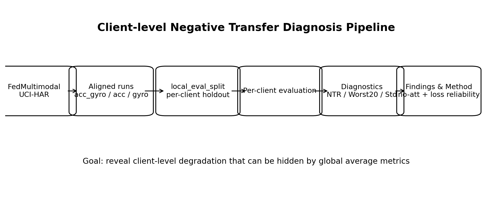
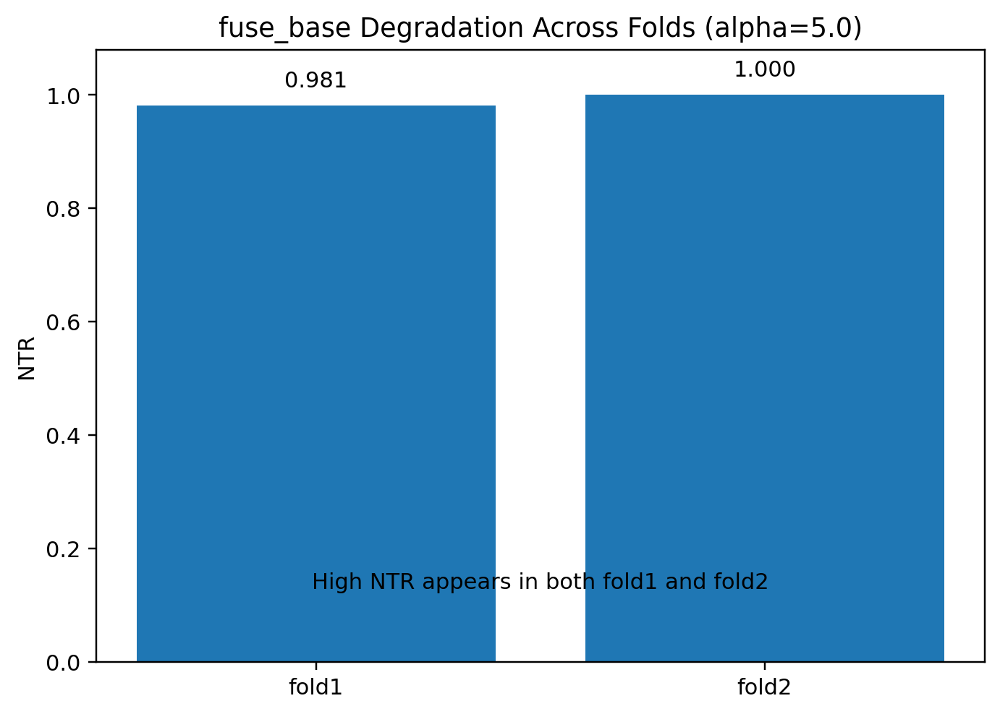
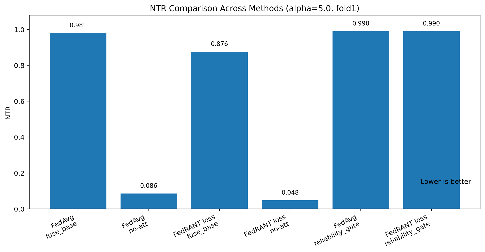
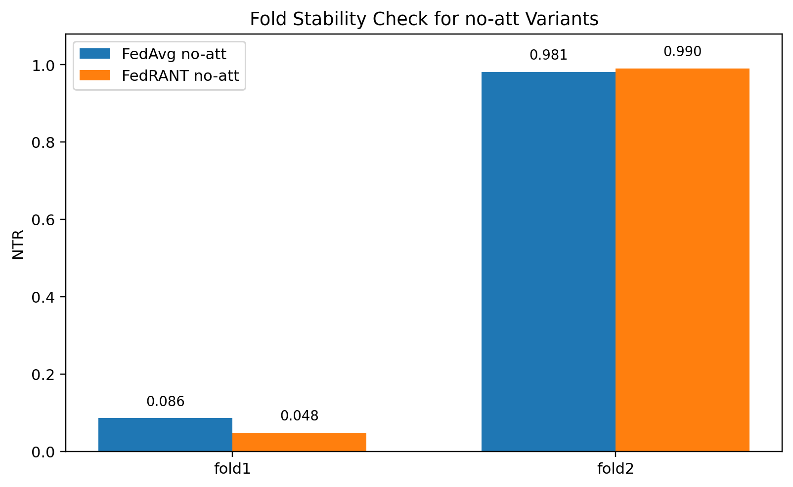
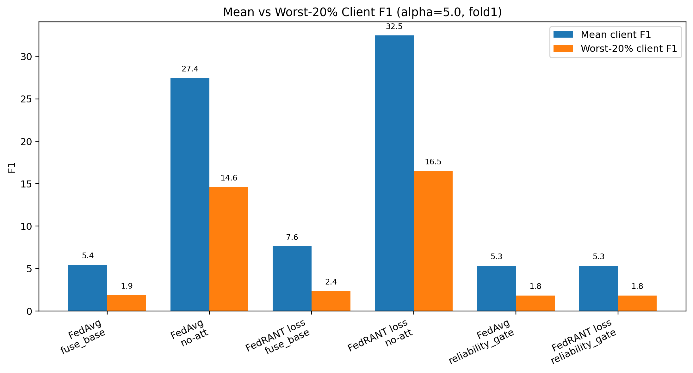
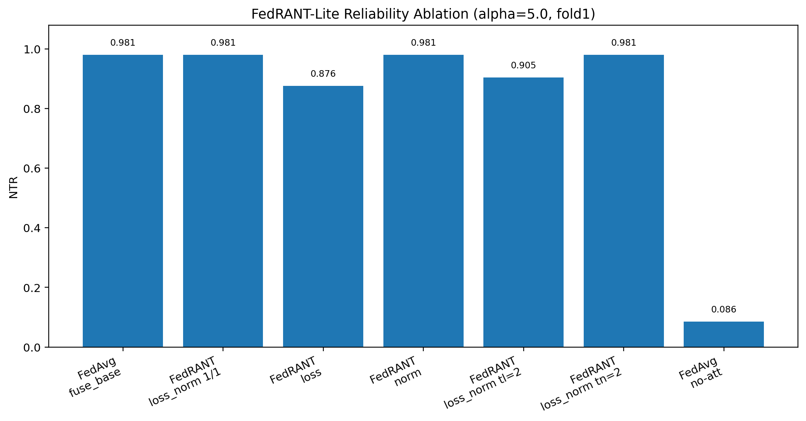
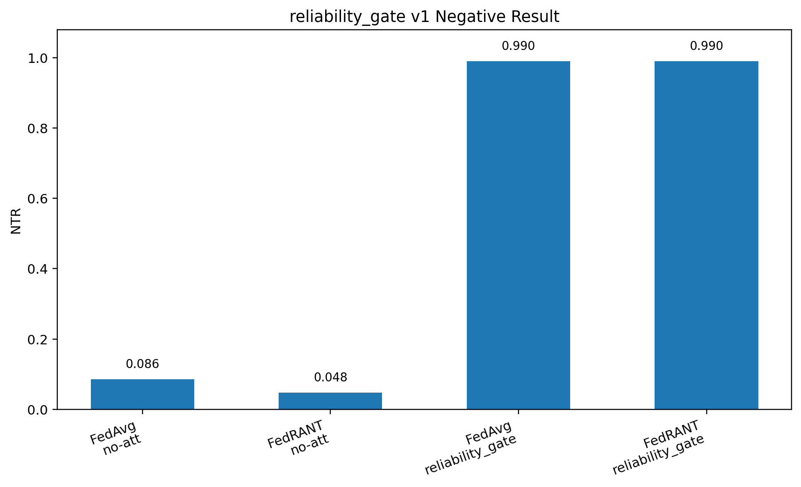

# Client-level Negative Transfer Diagnosis and Reliability-aware Aggregation for Multimodal Federated Learning

## Abstract Draft

Multimodal federated learning is usually evaluated by global average accuracy or F1, but these aggregate metrics may hide client-level degradation: for some clients, a multimodal model can underperform the best single-modality baseline. This work studies this problem in the UCI-HAR acc/gyro setting of FedMultimodal. We introduce a client-level diagnosis protocol based on local client holdout splits, aligned multimodal and single-modality runs, and Negative Transfer Rate (NTR). Our diagnosis reveals that the `fuse_base` attention setting can produce severe hidden client-level degradation under alpha=5.0, while a no-attention (no-att) multimodal baseline changes this behavior substantially. We further implement FedRANT-Lite, a server-side loss-based reliability aggregation method using training-time loss without accessing local evaluation, test, or NTR signals during training. Preliminary results show mixed behavior: loss-based reliability aggregation gives weak improvement under `fuse_base` and a positive signal with no-att on fold1, but the fold2 stability check does not reproduce the aggregation gain. These findings suggest that the diagnostic protocol is currently the strongest contribution, while reliability-aware aggregation remains a promising but unvalidated direction requiring more folds and missing-modality experiments.

## 1. Introduction

Multimodal federated learning aims to learn from complementary sensor or modality streams while keeping data decentralized on clients. In most experimental reports, the primary evidence is global average performance, such as average accuracy, macro-F1, or top-k accuracy on a global test set. These metrics are useful for summarizing the overall behavior of a global model, but they do not directly answer whether every participating client benefits from multimodal fusion. In federated settings, this distinction matters because each client may have a different data distribution, sample size, label composition, or modality quality. A method that improves the global average can still degrade the model seen by a subset of clients.

This paper focuses on this client-level failure mode. We use the term client-level degradation or client-level negative transfer to describe the case where the multimodal model performs worse for a client than the best available single-modality baseline for the same client. In the UCI-HAR acc/gyro setting, the multimodal model receives both acceleration and gyroscope features, while the single-modality baselines receive only acc or only gyro. Although acc and gyro are complementary in principle, their fusion is not guaranteed to help every client under non-IID federated training. The diagnostic question is therefore not only whether `acc_gyro` improves the global average, but also whether some clients would have been better served by `acc` or `gyro` alone.

Our work is built on the FedMultimodal codebase, but the goal is not a simple reproduction of its global results. Instead, we first construct a client-level diagnosis protocol that makes negative transfer measurable. This protocol introduces local client holdout evaluation, aligned multimodal and single-modality runs, per-client evaluation outputs, and strict split checking. It allows us to compare `acc_gyro`, `acc`, and `gyro` under the same dataset, fold, client set, local evaluation ratio, and local evaluation seed.

The diagnosis reveals that evaluation at the client level can lead to different conclusions from global average reporting. In particular, under the UCI-HAR alpha=5.0 setting, the `fuse_base` attention setting shows severe client-level degradation on fold1 and fold2. A no-att sanity check substantially changes this degradation pattern, suggesting that fusion/attention design is a major risk source. This finding motivates a cautious method exploration: rather than assuming a heavy fusion module is always beneficial, we examine whether simpler fusion combined with reliability-aware aggregation can reduce client-level negative transfer.

Figure 1 summarizes the overall diagnosis pipeline used in this work.

This draft makes four contributions. First, it introduces a client-level local holdout protocol for multimodal federated diagnosis. Second, it defines and uses NTR, Worst-20% F1, and client variance/std to quantify client-level degradation beyond global average metrics. Third, it diagnoses the risk of the `fuse_base` attention setting and shows that no-att multimodal fusion is an important baseline. Fourth, it implements FedRANT-Lite, a loss-based reliability aggregation method, and reports preliminary positive and negative evidence. The method claim is intentionally limited: FedRANT-Lite with no-att gives a positive signal on fold1, but fold2 does not reproduce the aggregation gain. Therefore, the current method result should be treated as preliminary and requiring more folds and missing-modality validation.

## 2. Problem Setup

We consider a standard cross-client federated learning setting with clients indexed by \(k\). Each client owns local training data and participates in federated optimization without sharing raw data. In the UCI-HAR setting, each sample has two sensor modalities:

- acceleration (`acc`);
- gyroscope (`gyro`).

We compare three model/input settings:

- multimodal `acc_gyro`;
- single-modality `acc`;
- single-modality `gyro`.

For each client, we evaluate the final global model on a local holdout split. Let \(F1_{multi}(k)\) denote the multimodal F1 for client \(k\), and let \(F1_{acc}(k)\), \(F1_{gyro}(k)\) denote the two single-modality F1 scores. The best single-modality reference is:

\[
F1_{single}^{best}(k) = \max(F1_{acc}(k), F1_{gyro}(k)).
\]

The client-level gap is:

\[
gap(k) = F1_{multi}(k) - F1_{single}^{best}(k).
\]

A client is counted as negative transfer if:

\[
gap(k) < -\epsilon.
\]

In the current implementation, F1 is stored as a percentage in \([0, 100]\), and the default \(\epsilon\) is 1.0.

## 3. Client-level Diagnosis Protocol

The diagnosis protocol is designed to avoid relying only on global test results or train-time client metrics. Its purpose is to construct an aligned, client-level view of whether multimodal fusion helps or hurts each client relative to single-modality alternatives. The key design principle is that client-level diagnosis should be based on held-out local data and matched experimental conditions, rather than on training loss or mixed historical outputs.

### 3.1 Local evaluation split

For each client, the local records are split into `local_train` and `local_eval`. The `local_train` portion is used for local model updates during federated training, while the `local_eval` portion is held out and used only after training to evaluate the final global model on that client. This differs from train-time client metrics, which can be biased by the data used for optimization. The local holdout split provides a more meaningful estimate of how the final global model behaves on each client's own distribution.

The split is controlled by a local evaluation ratio, a local evaluation seed, and a minimum sample requirement. In the current experiments, the standard setting uses `local_eval_ratio=0.2`, `local_eval_seed=2026`, and `local_eval_min_samples=5`. The same split generation logic is used for multimodal and single-modality runs, which is necessary for fair client-level comparison.

### 3.2 Aligned three-way comparison

For each experimental setting, the protocol runs three matched experiments: an `acc_gyro` multimodal run, an `acc` single-modality run, and a `gyro` single-modality run. The acc-only and gyro-only baselines are true single-modality baselines, not zero-filled or missing-modality simulations. This distinction is important because the diagnostic target is whether the multimodal model outperforms the best clean single-modality alternative for the same client.

The three runs are aligned by dataset, alpha, fold, local evaluation ratio, local evaluation seed, and client identifiers. For a valid NTR comparison, client \(k\) in the multimodal run must correspond to the same client \(k\) in both single-modality runs. The local evaluation indices should also be generated by the same strategy so that differences are not caused by comparing different local holdout samples. In practice, the diagnosis script performs strict split checking over fields such as fold, client ID, evaluation data type, local evaluation seed, local evaluation ratio, and local evaluation sample count.

### 3.3 Metrics

The primary metric is Negative Transfer Rate (NTR). For each valid client \(k\), let \(F1_{multi}(k)\) be the F1 score of the multimodal model on that client's local evaluation split. Let \(F1_{acc}(k)\) and \(F1_{gyro}(k)\) be the corresponding single-modality F1 scores. The best single-modality reference is:

\[
F1_{best\_single}(k) = \max(F1_{acc}(k), F1_{gyro}(k)).
\]

The client-level gap is:

\[
gap(k) = F1_{multi}(k) - F1_{best\_single}(k).
\]

A client is counted as negative transfer if:

\[
gap(k) < -\epsilon.
\]

Since the current F1 values are stored as percentages in \([0,100]\), the default threshold is \(\epsilon=1.0\). This avoids treating tiny numerical differences as meaningful degradation. NTR is then the fraction of valid clients that satisfy this negative-transfer condition.

In addition to NTR, the protocol reports worst-client and dispersion metrics. Worst-20% F1 is computed by sorting clients by multimodal F1 and averaging the bottom 20%. This metric is intended to expose tail-client behavior that can be invisible in a global mean. Client variance and standard deviation measure the spread of per-client multimodal F1, helping distinguish uniformly low performance from high inequality across clients. The global `result.json` F1 is still reported, but mainly as a conventional reference rather than the only evaluation target.

### 3.4 Output isolation and reproducibility

The protocol uses `run_id` output isolation to prevent repeated smoke tests or formal runs from appending into the same CSV files. This matters because `per_client_eval_metrics.csv` is used as the source for NTR computation; if historical records from different runs are mixed into the same file, the diagnosis can become ambiguous even if the script attempts to deduplicate rows. Each formal run writes its `result.json`, `per_client_eval_metrics.csv`, and `local_eval_split_fold{fold}.json` into a run-specific directory.

The diagnosis script also writes its own outputs into a specified directory: `client_level_negative_transfer.csv`, `diagnosis_summary.csv`, and `diagnosis_config.json`. The config file records the three input CSVs and the parameters used for diagnosis. This makes it possible to trace exactly which multimodal, acc-only, and gyro-only runs were compared.

Strict split checking and run-level output isolation serve different purposes. Strict split checking prevents invalid comparisons across mismatched folds, clients, seeds, ratios, or sample counts. Output isolation prevents accidental contamination from previous smoke tests or formal runs. Together, these design choices reduce two common sources of confusion: comparing non-aligned client records and drawing conclusions from polluted result files.

## 4. Method: FedRANT-Lite

FedRANT-Lite is a lightweight server-side reliability-aware aggregation method. Its design goal is deliberately modest: instead of changing the multimodal model architecture or the local training objective, it only changes how the server weights client updates during aggregation. This keeps the method close to FedAvg and makes it easier to separate the effect of aggregation reliability from the effect of fusion architecture.

FedRANT-Lite does not modify client local training. Each selected client trains with the same local objective and optimizer as in the corresponding FedAvg run. After local training, the server receives the client model update and the training-time statistics that are already available during federated optimization. The method does not use `local_eval`, test metrics, NTR, or per-client evaluation F1 as training signals. Those quantities are reserved for post-hoc diagnosis only. This separation is important because the diagnosis protocol is intended to evaluate client-level negative transfer, not to act as an oracle for training-time weighting.

The core assumption is that some client updates may be less reliable in a given communication round. In the current implementation, reliability is estimated from training-time signals. We considered train loss, update norm, and a combined loss_norm score. The current experiments suggest that train loss is the most useful of these signals, while update norm and combined loss_norm produce less stable gains. Intuitively, a higher local training loss indicates that the current global model and local update fit that client's data less well, so the corresponding update may need to be down-weighted during aggregation. This is a heuristic rather than a guaranteed measure of client quality, and it may bias the aggregation toward easier clients; this limitation is discussed later.

### 4.1 Aggregation rule

FedAvg uses sample-count weighting. For client \(k\), let \(n_k\) denote the number of local training samples. FedAvg effectively aggregates by:

\[
w_k = \frac{n_k}{\sum_j n_j}.
\]

FedRANT-Lite keeps the sample count as the base weight, but rescales it by a reliability score. Let \(L_k\) be the training loss reported by client \(k\) in the current round. We normalize the losses among the sampled clients:

\[
\widetilde{L}_k = \frac{L_k - \min_j L_j}{\max_j L_j - \min_j L_j + \epsilon}.
\]

The loss-based reliability score is:

\[
r_k = \exp(-\tau_{loss} \cdot \widetilde{loss}_k),
\]

where \(\tau_{loss}\) controls how strongly high-loss clients are down-weighted. In implementation, \(r_k\) can also be clipped by minimum and maximum reliability bounds to avoid extreme weights. The final aggregation weight is:

\[
w_k = \frac{n_k r_k}{\sum_j n_j r_j}.
\]

Thus, the base contribution of a client still grows with its sample count, but a client with lower reliability receives a smaller effective aggregation weight. If all reliability scores are similar, the method approaches sample-count-weighted FedAvg. If some clients have much higher normalized training loss, their updates are reduced.

### 4.2 Design boundary

FedRANT-Lite is deliberately limited. It is not a complex fusion module, a modality completion method, or a local evaluation oracle. It can be combined with different multimodal fusion settings, including `fuse_base` and no-att fusion, because it operates only at the server aggregation stage.

The method also logs the aggregation process in `rant_weights.csv`, including sample counts, reliability scores, final weights, train loss, train F1, and update norm. This log is used for interpretability after training. It is not used to tune weights online in the current implementation.

### 4.3 Current method status

Current evidence suggests that FedRANT-Lite is more reasonable when paired with no-att multimodal fusion than when paired with `fuse_base`. Under `fuse_base`, loss-based FedRANT-Lite provides only weak improvement and cannot repair the severe client-level degradation caused by the fusion setting. Under no-att fusion, fold1 shows a positive signal: NTR and Worst-20% F1 improve without hurting global F1. However, the fold2 stability check does not reproduce this gain. Therefore, FedRANT-Lite should be described as a candidate reliability-aware aggregation component, not as a validated solution.

## 5. Experimental Setup

The experiments are based on the FedMultimodal KDD 2023 codebase and use the UCI-HAR acc/gyro setting. UCI-HAR provides sensor features from acceleration and gyroscope streams. We evaluate a multimodal `acc_gyro` setting and two true single-modality baselines, `acc` and `gyro`. The single-modality baselines use only their corresponding records and models; they are not constructed by zeroing or masking the unused modality. This is important because NTR compares a multimodal model against clean single-modality alternatives.

The federated setting follows the FedMultimodal training pipeline with controlled additions for fold selection, run-level output isolation, and local client holdout evaluation. We evaluate alpha=0.1 and alpha=5.0, with most method diagnostics currently focused on alpha=5.0. We use fold1 and fold2 for the main diagnostic evidence, and fold3 remains a planned stability experiment. Unless otherwise stated, formal runs use sample_rate=0.1, num_epochs=50, learning_rate=0.05, global_learning_rate=0.025, local_epochs=1, local_eval_ratio=0.2, local_eval_seed=2026, and local_eval_min_samples=5.

The compared methods and settings include FedAvg with `fuse_base`, FedAvg with no-att multimodal fusion, FedRANT-Lite loss aggregation with `fuse_base`, FedRANT-Lite loss aggregation with no-att fusion, FedRANT-Lite reliability ablations, and reliability_gate v1. The acc-only and gyro-only runs are used as single-modality references for NTR computation rather than as direct multimodal methods.

The evaluation reports both conventional global and client-level diagnostic metrics. Global metrics are read from `result.json`, including F1, accuracy, and top-5 accuracy. Client-level metrics include NTR, negative clients, mean multimodal F1, Worst-20% F1, median client F1, variance, and standard deviation. For FedRANT-Lite, `rant_weights.csv` is used to analyze reliability scores, final aggregation weights, train loss, and update norm. For reliability_gate, `gate_weights.csv` is used to inspect gate balance and entropy. These logging files support interpretation but are not used as training-time evaluation signals.

Several safeguards are used to keep the experiments reproducible and avoid output contamination. Each formal run uses a distinct `run_id`, and `metrics_write_mode=error_if_exists` prevents accidental appending to existing CSV files. Each run writes a fold-specific `local_eval_split_fold{fold}.json`, and NTR computation uses strict split checking to verify aligned fold, client IDs, local evaluation ratio, seed, and sample counts across `acc_gyro`, `acc`, and `gyro`. No local_eval metrics, test metrics, NTR values, or per-client evaluation F1 scores are used during training; they are only used after training for diagnosis.

## 6. Preliminary Results

These are preliminary results and should not yet be treated as final paper conclusions.

### 6.1 fuse_base causes severe client-level degradation

The clearest diagnostic finding is that the `fuse_base` attention/fusion setting can create severe client-level degradation under alpha=5.0. In fold1, FedAvg with `fuse_base` reaches NTR=0.980952, with 103 out of 105 clients counted as negative transfer clients. The mean client-level multimodal F1 is only 5.441510. In fold2, the pattern becomes even stronger: NTR=1.000000, all 105 clients are negative transfer clients, and mean_multi_f1 is 5.223903.

| setting | NTR | negative clients | mean_multi_f1 |
|---|---:|---:|---:|
| alpha=5.0 fold1 | 0.980952 | 103 / 105 | 5.441510 |
| alpha=5.0 fold2 | 1.000000 | 105 / 105 | 5.223903 |

The fact that high NTR appears in both fold1 and fold2 suggests that this is not simply a single-fold accident. It also shows why global result reporting alone is insufficient: a global summary can fail to reveal that most clients perform worse under multimodal fusion than under their best single-modality baseline. At this stage, the safest interpretation is that `fuse_base` is risky under this UCI-HAR alpha=5.0 setting, especially when evaluated through client-level local holdout metrics.

Figure 4 visualizes the `fuse_base` degradation across fold1 and fold2, while Figure 2 places this result in the broader NTR comparison.

### 6.2 no-att substantially reduces degradation but is fold-dependent

The no-att sanity check changes the interpretation of the problem. On fold1, removing `fuse_base` attention substantially reduces client-level negative transfer. FedAvg no-att reaches NTR=0.085714, with 9 negative clients out of 105, mean_multi_f1=27.439009, worst20_multi_f1=14.588930, and global result.json F1=36.609368. Compared with FedAvg `fuse_base`, this is a large improvement in both client-level and global metrics.

| method | NTR | negative clients | mean_multi_f1 | worst20_multi_f1 | result.json F1 |
|---|---:|---:|---:|---:|---:|
| FedAvg fuse_base | 0.980952 | 103 | 5.441510 | 1.879602 | 19.217786 |
| FedAvg no-att | 0.085714 | 9 | 27.439009 | 14.588930 | 36.609368 |

Fold2 gives a more cautious picture. FedAvg no-att fold2 still improves over FedAvg `fuse_base` fold2 in mean_multi_f1, Worst-20% F1, median F1, and global result.json F1. However, NTR remains high: FedAvg no-att fold2 has NTR=0.980952, 103 negative clients, mean_multi_f1=13.680920, and result.json F1=21.460767. Thus, no-att is more stable than `fuse_base` in performance, but it is not a complete solution to client-level negative transfer across folds.

This result is important for the paper narrative. It suggests that the severe fold1 `fuse_base` degradation is strongly tied to the fusion/attention configuration, but it also shows that simply removing attention does not guarantee low NTR on every fold.

Figure 5 highlights the fold stability check for no-att variants. Figure 3 compares mean client F1 and Worst-20% F1 across representative methods.

### 6.3 FedRANT-Lite gives mixed aggregation results

We next evaluate whether reliability-aware aggregation can mitigate client-level degradation. Under `fuse_base`, the best FedRANT-Lite ablation is loss-based reliability. It reduces NTR from 0.980952 to 0.876190 and reduces negative clients from 103 to 92, while mean_multi_f1 increases from 5.441510 to 7.610062. The global result.json F1 is 19.581561, close to FedAvg `fuse_base`.

| method | NTR | negative clients | mean_multi_f1 | worst20_multi_f1 | result.json F1 |
|---|---:|---:|---:|---:|---:|
| FedAvg fuse_base | 0.980952 | 103 | 5.441510 | 1.879602 | 19.217786 |
| FedRANT loss fuse_base | 0.876190 | 92 | 7.610062 | 2.350736 | 19.581561 |

This is a weak but meaningful signal: train-loss-based reliability can change the client-level outcome, but it cannot repair the main `fuse_base` failure mode.

The more promising result appears when FedRANT-Lite loss aggregation is combined with no-att fusion on fold1. Compared with FedAvg no-att, FedRANT no-att reduces NTR from 0.085714 to 0.047619, reduces negative clients from 9 to 5, increases mean_multi_f1 to 32.452982, and improves worst20_multi_f1 to 16.501867. The global result.json F1 remains essentially unchanged.

| method | NTR | negative clients | mean_multi_f1 | worst20_multi_f1 | median_multi_f1 | result.json F1 |
|---|---:|---:|---:|---:|---:|---:|
| FedAvg no-att | 0.085714 | 9 | 27.439009 | 14.588930 | 26.111111 | 36.609368 |
| FedRANT loss no-att | 0.047619 | 5 | 32.452982 | 16.501867 | 33.333333 | 36.637316 |

However, the fold2 stability check does not reproduce this gain. In fold2, FedAvg no-att reaches NTR=0.980952, while FedRANT no-att reaches NTR=0.990476. FedRANT no-att also has slightly lower mean_multi_f1, worst20_multi_f1, median_multi_f1, and global result.json F1 than FedAvg no-att.

| method | fold | NTR | negative clients | mean_multi_f1 | worst20_multi_f1 | median_multi_f1 | result.json F1 |
|---|---:|---:|---:|---:|---:|---:|---:|
| FedAvg no-att | 2 | 0.980952 | 103 | 13.680920 | 5.550552 | 14.358974 | 21.460767 |
| FedRANT loss no-att | 2 | 0.990476 | 104 | 13.336897 | 5.219807 | 13.888889 | 14.900063 |

Therefore, the correct conclusion is mixed. FedRANT-Lite loss aggregation shows preliminary promise in fold1, especially when paired with no-att fusion, but the gain is not yet stable across folds. At the current stage, FedRANT-Lite should be treated as a useful candidate component that requires further validation rather than a final method.

Figure 6 summarizes the FedRANT-Lite reliability ablation and shows that loss-based reliability is the best current aggregation-only variant under `fuse_base`, although it remains far from the no-att baseline.

### 6.4 reliability_gate v1 is a negative result

We also tested reliability_gate v1, a lightweight learnable fusion gate. This was intended to see whether a simple modality gate could replace `fuse_base` and learn a safer acc/gyro mixture. The gate did not collapse; its learned weights remained close to balanced and slightly biased toward acc. However, it did not improve client-level behavior.

| method | NTR | negative clients | mean_multi_f1 | result.json F1 |
|---|---:|---:|---:|---:|
| FedAvg gate | 0.990476 | 104 / 105 | 5.322727 | 11.880765 |
| FedRANT gate | 0.990476 | 104 / 105 | 5.322727 | 11.987033 |

Both FedAvg gate and FedRANT gate have NTR=0.990476 and 104 negative clients. This negative result suggests that a simple learnable gate is not currently the main direction. If fusion reliability is revisited, it likely needs stronger structure, explicit modality-quality estimation, or regularization beyond the current v1 gate.

Figure 7 reports the reliability_gate negative result. An auxiliary gate-weight behavior plot is available for checking that the gate did not simply collapse to one modality.

## 7. Negative Findings and Discussion

The negative and mixed findings are informative rather than merely disappointing. They help separate the stable diagnostic contribution from the still-preliminary method contribution.

First, aggregation-only reliability cannot repair an unstable fusion design by itself. Under `fuse_base`, FedRANT-Lite loss improves NTR and mean client-level F1 slightly, but the system still has many negative-transfer clients. This suggests that the main failure mode is not only that FedAvg weights unreliable clients too heavily; the fusion/attention mechanism itself can create harmful client-level behavior.

Second, simple reliability signals are limited. Train loss appears more useful than update norm in the current ablations, but even loss-based weighting is not reliably beneficial across folds. This may happen because high loss can indicate a difficult but important client rather than an unreliable update. Down-weighting such clients may improve some rounds or folds but harm others. Therefore, FedRANT-Lite should be described as a lightweight candidate rather than a complete solution.

Third, reliability_gate v1 is insufficient. The gate did not collapse, which means the failure is not simply caused by a degenerate one-modality solution. Instead, a balanced learnable gate still failed to improve NTR. This suggests that naive gating does not provide a reliable modality-quality estimate in the current setup. If fusion reliability remains a direction, it needs more careful design than the current v1 gate.

Fourth, the fold2 stability result is the main caution for the method claim. FedRANT no-att fold1 is the most positive method result so far, but fold2 does not reproduce the aggregation gain. No-att still appears safer than `fuse_base`, but FedRANT-Lite does not yet have stable evidence across folds. The paper should therefore describe FedRANT-Lite as showing preliminary promise under no-att on fold1, while still requiring further validation.

Overall, the diagnosis contribution remains strong: the platform exposes client-level degradation, identifies `fuse_base` as a risky setting, and shows why global average performance is insufficient. The method contribution should be framed as an initial reliability-aware aggregation attempt guided by this diagnosis. The next experiments should focus on fold3, alpha=0.1, missing-modality diagnosis, and client-level analysis of `rant_weights.csv` before deciding how strongly to position FedRANT-Lite in the final paper.

## 8. Next Experiments

The next experiments should focus on validation rather than adding new modules. The most urgent step is fold3 stability validation for the no-att setting. The current fold1 and fold2 results lead to different interpretations of FedRANT-Lite loss aggregation: fold1 suggests that FedRANT no-att can reduce NTR and improve Worst-20% F1, while fold2 does not reproduce this gain. A fold3 run should therefore compare FedAvg no-att and FedRANT loss no-att under the same alpha=5.0, sample rate, learning rate, local evaluation split, and NTR protocol. If fold3 behaves closer to fold1, FedRANT no-att can remain a plausible method candidate. If fold3 behaves closer to fold2, the method should be framed more conservatively as an auxiliary reliability component rather than the main solution.

The second validation direction is alpha=0.1. We already have baseline diagnosis under alpha=0.1, where negative transfer is much lower than in alpha=5.0 but tail-client performance remains weak. Running FedRANT no-att under alpha=0.1 would test whether loss-based reliability aggregation has value outside the current high-degradation alpha=5.0 setting. This is important because a method that only works in one heterogeneity condition would need a narrower claim.

The third direction is missing-modality diagnosis. The current experiments are clean setting experiments: all modalities are available, and the comparison focuses on fusion and aggregation behavior. However, missing or unreliable modality streams are a central practical issue in multimodal federated learning. Future experiments should introduce missing-modality settings and measure how NTR, negative clients, Worst-20% F1, and variance change. These experiments can test whether no-att fusion and FedRANT-Lite remain useful when modality availability is less reliable.

The fourth direction is interpretability analysis using `rant_weights.csv`. The current method logs reliability scores, final aggregation weights, train loss, train F1, and update norm. These logs should be analyzed at the client level to identify which clients are repeatedly down-weighted. A useful analysis would test whether down-weighted clients overlap with high-loss clients, negative-transfer clients, or clients with poor local_eval behavior. This would not prove causality, but it would make the aggregation behavior more interpretable and help decide whether the reliability signal is meaningful.

The final method decision should be made after these validations. If fold3 supports the fold1 pattern and missing-modality experiments also show consistent gains, FedRANT no-att can continue as the main method candidate. If fold3 is closer to fold2, or if missing-modality experiments do not show reliable improvement, FedRANT-Lite should be positioned as a diagnostic or auxiliary component rather than the central method contribution. In either case, the client-level diagnosis protocol remains a stable contribution because it exposes degradation patterns that global average metrics alone cannot show.

## Conclusion Draft

This work starts from client-level negative transfer diagnosis rather than global-average reproduction. We build a diagnosis protocol with `local_eval_split`, aligned acc_gyro/acc/gyro comparison, NTR, Worst-20% F1, and client variance/std. Using this protocol, we find that `fuse_base` attention can cause severe client-level degradation in the UCI-HAR alpha=5.0 setting, and that a no-att sanity check substantially changes the client-level behavior. These findings suggest that fusion/attention design is a key risk source and that global average metrics alone are not sufficient for evaluating multimodal federated learning.

We also implement FedRANT-Lite, a loss-based reliability aggregation method that uses only training-time signals and does not access local_eval, test, or NTR information during training. FedRANT-Lite shows a positive signal with no-att on fold1, but this gain is not reproduced on fold2. In addition, reliability_gate v1 is a negative result: the gate does not collapse, but it does not improve client-level degradation. Therefore, the current conclusion should remain cautious. The diagnostic contribution is stronger and more stable than the method contribution, while reliability-aware aggregation remains a preliminary direction that requires more folds, alpha=0.1 validation, missing-modality experiments, and client-level weight analysis before stronger claims can be made.

## Table Placeholders

Table 1: Diagnosis platform components.

| Component | Purpose | Output / Artifact | Why it matters |
|---|---|---|---|
| `local_eval_split` | Split each client's local data into `local_train` and `local_eval`. | `local_eval_split_fold{fold}.json` | Enables client-level evaluation on held-out local data rather than train-time metrics. |
| Per-client evaluation | Evaluate the global model separately on each client's `local_eval` split. | `per_client_eval_metrics.csv` | Reveals heterogeneous client-level behavior hidden by global averages. |
| Aligned multimodal and unimodal baselines | Compare `acc_gyro` with acc-only and gyro-only under the same client split. | `acc_gyro` / `acc` / `gyro` per-client CSVs | Enables client-level negative transfer diagnosis. |
| Negative Transfer Rate (NTR) | Measure how often multimodal F1 is lower than the best single-modality F1 by more than eps. | `diagnosis_summary.csv` | Quantifies client-level negative transfer. |
| Worst-20% F1 | Measure the mean F1 of the bottom 20% clients. | `diagnosis_summary.csv` | Captures tail-client performance. |
| Client variance / std | Measure dispersion of client-level F1. | `diagnosis_summary.csv` | Shows fairness and stability across clients. |
| Strict split check | Verify multi / acc / gyro runs use compatible `local_eval` splits. | Diagnosis warnings or errors | Prevents invalid client-level comparisons. |
| `run_id` output isolation | Isolate smoke tests, formal runs, and repeated experiments. | `result/.../runs/{run_id}/` | Avoids CSV contamination and accidental overwrite. |
| Diagnostic output package | Save client-level gaps and summary metrics. | `client_level_negative_transfer.csv`, `diagnosis_summary.csv`, `diagnosis_config.json` | Makes the diagnosis reproducible and auditable. |

Table 1 summarizes the diagnostic infrastructure used throughout the paper. These components are independent of FedRANT-Lite itself. This is why the diagnostic contribution remains stable even when method results are mixed across folds.

Table 2: Main method comparison.

| Method | Fusion | Aggregation | Fold | NTR ↓ | Negative Clients ↓ | Mean F1 ↑ | Worst-20% F1 ↑ | Median F1 ↑ | Global F1 ↑ |
|---|---|---|---:|---:|---:|---:|---:|---:|---:|
| FedAvg `fuse_base` | `fuse_base` | sample-count FedAvg | 1 | 0.981 | 103/105 | 5.442 | 1.880 | 5.882 | 19.218 |
| FedAvg no-att | no-att | sample-count FedAvg | 1 | 0.086 | 9/105 | 27.439 | 14.589 | 26.111 | 36.609 |
| FedRANT-Lite loss `fuse_base` | `fuse_base` | loss-based reliability | 1 | 0.876 | 92/105 | 7.610 | 2.351 | 6.667 | 19.582 |
| FedRANT-Lite loss no-att | no-att | loss-based reliability | 1 | 0.048 | 5/105 | 32.453 | 16.502 | 33.333 | 36.637 |
| FedAvg reliability_gate | reliability_gate | sample-count FedAvg | 1 | 0.990 | 104/105 | 5.323 | 1.810 | 5.556 | 11.881 |
| FedRANT-Lite loss reliability_gate | reliability_gate | loss-based reliability | 1 | 0.990 | 104/105 | 5.323 | 1.810 | 5.556 | 11.987 |

Table 2 shows that no-att greatly reduces NTR compared with `fuse_base` on fold1. FedRANT-Lite loss further improves the no-att result on fold1, reducing NTR and improving mean and Worst-20% F1 without reducing global F1. In contrast, reliability_gate performs poorly despite not collapsing in its gate weights. These fold1 results should be interpreted together with the fold2 stability results in Table 4.

Table 3: FedRANT-Lite ablation.

| Method | Reliability Signal | NTR ↓ | Negative Clients ↓ | Mean F1 ↑ | Worst-20% F1 ↑ | Median F1 ↑ | Global F1 ↑ |
|---|---|---:|---:|---:|---:|---:|---:|
| FedAvg `fuse_base` | none | 0.981 | 103/105 | 5.442 | 1.880 | 5.882 | 19.218 |
| FedRANT-Lite default | loss_norm | 0.981 | 103/105 | 5.752 | 1.983 | 6.061 | 13.983 |
| FedRANT-Lite loss | loss | 0.876 | 92/105 | 7.610 | 2.351 | 6.667 | 19.582 |
| FedRANT-Lite norm | update_norm | 0.981 | 103/105 | 5.455 | 1.880 | 5.882 | 18.743 |
| FedRANT-Lite loss_norm tau_loss=2 | loss_norm, tau_loss=2 | 0.905 | 95/105 | 6.516 | 2.314 | 6.667 | 14.347 |
| FedRANT-Lite loss_norm tau_norm=2 | loss_norm, tau_norm=2 | 0.981 | 103/105 | 5.692 | 1.983 | 6.061 | 14.305 |
| FedAvg no-att | none, no-att fusion | 0.086 | 9/105 | 27.439 | 14.589 | 26.111 | 36.609 |

Among aggregation-only variants under `fuse_base`, loss-only gives the clearest improvement. It reduces NTR from 0.981 to 0.876 and improves Mean F1 and Worst-20% F1. In contrast, update_norm alone and stronger tau_norm do not meaningfully reduce NTR. However, all `fuse_base` FedRANT-Lite variants remain far worse than FedAvg no-att. This supports the conclusion that aggregation reliability alone cannot repair unstable `fuse_base` fusion. The stronger direction is to use stable no-att fusion and then evaluate reliability aggregation on top of it.

Table 4: Fold1 vs fold2 stability.

| Method | Fold | NTR ↓ | Negative Clients ↓ | Mean F1 ↑ | Worst-20% F1 ↑ | Median F1 ↑ | Global F1 ↑ |
|---|---:|---:|---:|---:|---:|---:|---:|
| FedAvg no-att | 1 | 0.086 | 9/105 | 27.439 | 14.589 | 26.111 | 36.609 |
| FedRANT-Lite loss no-att | 1 | 0.048 | 5/105 | 32.453 | 16.502 | 33.333 | 36.637 |
| FedAvg `fuse_base` | 2 | 1.000 | 105/105 | 5.224 | 1.956 | 5.556 | 12.849 |
| FedAvg no-att | 2 | 0.981 | 103/105 | 13.681 | 5.551 | 14.359 | 21.461 |
| FedRANT-Lite loss no-att | 2 | 0.990 | 104/105 | 13.337 | 5.220 | 13.889 | 14.900 |

Table 4 confirms that no-att remains better than `fuse_base` on fold2 in Mean F1, Worst-20% F1, Median F1, and Global F1. However, fold2 does not reproduce the low NTR observed in fold1. FedRANT-Lite loss no-att also does not outperform FedAvg no-att on fold2. Therefore, the aggregation gain is fold-dependent and should not be overstated.

Table 5: Missing modality results placeholder. TODO: fill after missing-modality runs are completed; expected columns include missing setting, method, fold, NTR, negative clients, mean_multi_f1, Worst-20% F1, and result.json F1.
